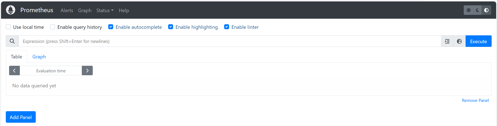

# prometheus_test

## 테스트 환경
H/W


S/W 


## Install Podman & Podman-compse 

Rocky Linux에서 podman-compose를 설치하는 방법은 다음과 같습니다. Podman은 Docker와 호환되는 오픈소스 컨테이너 엔진으로, 특히 루트리스 모드에서 작동할 수 있어 보안이 강화됩니다. podman-compose는 Podman을 사용하여 Docker Compose와 유사한 기능을 제공함.

### 1. Podman 설치(docker 대용)

패키지 업데이트:

```bash
sudo dnf update -y
```

Podman 설치:

```bash
sudo dnf install -y podman
```

Podman 버전 확인(docker 명령과 호환):

```bash
podman --version
docker --version
```

### 2. Podman-Compose 설치(docker-compose 대용)

pip 설치 (pip는 Python 패키지 관리 도구):

```bash
sudo dnf install -y python3-pip
```

Podman-Compose 설치:

```bash
sudo pip3 install podman-compose
```

docker-compse 링크 생성:

```bash
sudo ln -s /usr/local/bin/podman-compose /usr/bin/docker-compose
```

Podman-Compose 버전 확인:

```bash
podman-compose --version
docker-compose --version
```

## Run Prometheus

### Podman-compose 실행

Podman-Compose 실행:

```bash
podman-compose up -d
or
docker-compose up -d
```

Container 실행 확인:

```bash
podman-compose ps -a
or
docker-compose ps -a
```

### Prometheus 실행 확인

웹 브라우져에서 URL 입력:

```
http://{서버IP}:9090/
```
기본 화면


Status - Targets 화면

## Permission deny 에러 해결책

### 1. Check File Permissions and Ownership
파일 권한 변경:

```bash
chmod 644 prometheus.yml
```

파일 사용자/그룹 변경(필요 시):

```bash
ls -l prometheus.yml
```

```bash
chown vagrant:vagrant prometheus.yml
```

### 2. SELinux Context (If Applicable)

SELinux는 Security Enhanced Linux의 약자로, 리눅스 보안 시스템 아키텍처의 하나로 시스템 액세스 권한을 제어하는 역할을 합니다. SELinux를 사용하면 시스템 보안에 영향을 미치는 기능이 감지되면 그 기능을 작동하지 않도록 막거나, 허용은 하되 그 내용을 로그에 남기는 등의 설정을 할 수 있습니다. 예를 들어, SELinux를 사용하면 루트 권한이 할당된 프로세스가 연결된 정책에 지정된 기기에만 쓸 수 있도록 제한할 수 있음.

실제 이 명령만 실행하면 끝:

```bash
chcon -Rt svirt_sandbox_file_t prometheus.yml
```

### 3. Restart Docker Compose
위 설정 후 실행:

```bash
docker-compose down
docker-compose up
```

## Granfana 연결

### Granfana 실행 확인

웹 브라우져에서 URL 입력:

```
http://{서버IP}:3000/
```
로그인 화면:


패스워드 변경 화면 : skip or change


### Data source 추가

Open Menu - Data Sources : 


Add Data Source : 


### Prometheus 설정

Input Connection : http://{서버 IP}:9090


Save & test :


### Dashboard 추가

Open Menu - Dashboard :


Create dashboard - Import dashboard :


Load [Node Exporter Full](https://grafana.com/grafana/dashboards/1860-node-exporter-full/) :


Import Data source : Prometheus


Monitoring Node :

